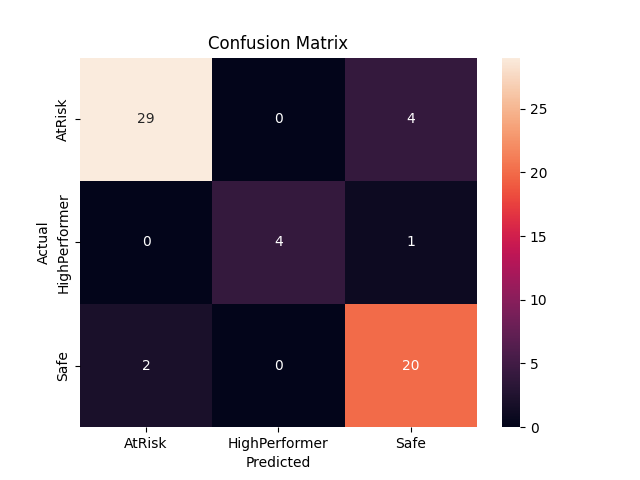
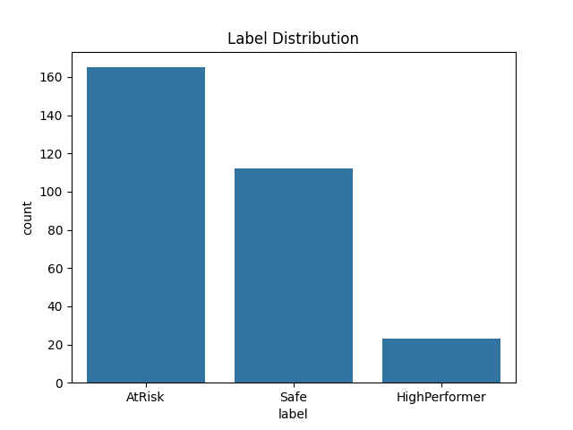
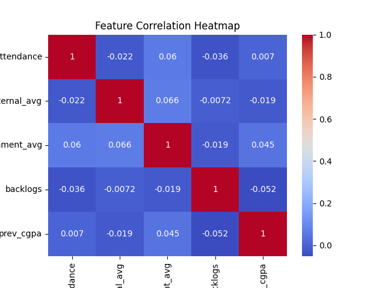
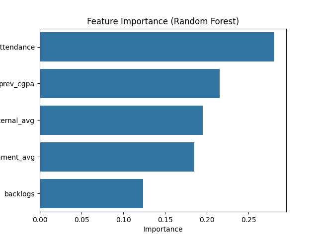
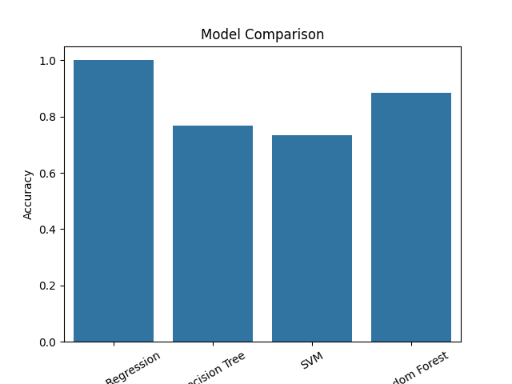

# 🚀 EduVision — AI-Powered Student Performance Analysis System

## 📌 Overview
EduVision is a full-stack machine learning–driven web application that predicts and analyzes student performance based on academic and behavioral data.

The system integrates:
- Data Analysis  
- Machine Learning Models  
- Django Web Framework  

to provide actionable insights for both students and educators.

---

## 🎯 Problem Statement
Educational institutions often lack systems to:
- Identify underperforming students early  
- Analyze performance trends  
- Provide data-driven insights  

EduVision addresses this by building an intelligent prediction and analysis system that supports informed decision-making.

---

## 💡 Key Features

### 🔮 Performance Prediction
- Predicts student category: Excellent / Average / Poor  
- Based on marks, attendance, and assignments  

---

### 📊 Data Analysis & Insights
- Confusion Matrix for evaluation  
- Feature Correlation Heatmap  
- Feature Importance Analysis  
- Data Distribution  

---

### ⚖️ Model Comparison
- Multiple ML models evaluated  
- Best-performing model selected  

---

### 👨‍🏫 Teacher Dashboard
- Analyze student performance  
- Categorize students  
- Identify weak students with reasons  

---

### 🎓 Student Dashboard
- View subject-wise performance  
- Personalized feedback  
- Suggestions for improvement  
- Rank and class comparison  

---

### 🤖 Smart Chatbot
- Answers queries like:
  - “How is my performance?”
  - “Which subjects are weak?”
  - “How can I improve?”

---

## 🧠 Machine Learning Pipeline

### 1. Data Generation
Due to limited availability of structured datasets, synthetic data was generated to simulate realistic student scenarios.

---

### 2. Data Preprocessing
- Handling missing values  
- Feature encoding  
- Data normalization  

---

### 3. Exploratory Data Analysis (EDA)
- Feature relationships  
- Distribution analysis  
- Key influencing factors  

---

### 4. Model Training
Models used:
- Logistic Regression  
- Decision Tree  
- Random Forest  
We finaly used Random forest for prediction and analysis.
---

### 5. Model Evaluation
- Accuracy  
- Confusion Matrix  
- Performance comparison  

---

## 📊 Results & Visual Insights











---

## 🛠️ Tech Stack

### 💻 Backend
- Python  
- Django  

### 🤖 Machine Learning
- Scikit-learn  
- Pandas  
- NumPy  

### 📈 Visualization
- Matplotlib  
- Seaborn  

---

## ⚙️ Installation & Setup

```bash
git clone https://github.com/TushtiSavarn/EduVision.git
cd EduVision/predict
python -m venv venv
venv\Scripts\activate
pip install -r requirements.txt
python manage.py runserver
```

## 📂 Project Structure
```
EduVision/
│── predict/        # Django project
│── ml/             # ML logic
│── data/           # Dataset
│── assets/         # Graphs & visuals
│── docs/           # Project reports
│── README.md
```
## 👥 Team Contribution

This project was developed as part of an MCA in-house project by:
- Barkha Pathak (https://www.linkedin.com/in/barkhapathak/)
- Nandini Pandey (https://www.linkedin.com/in/nandini-pandey0510/)
- Tushti Savarn(https://www.linkedin.com/in/tushti-savarn/)

## 🧠 My Contribution
- Implemented ML pipeline and prediction logic
- Performed data preprocessing and feature engineering
- Integrated ML model with Django backend
- Developed performance analysis system
- Led coordination and overall project execution

## 🔮 Future Enhancements
- Integration with real-world datasets
- Deployment on cloud (AWS / Render)
- REST API for external integration
- Advanced ML models (XGBoost, Neural Networks)

## 👩‍💻 Author

Tushti Savarn (https://www.linkedin.com/in/tushti-savarn/) (https://medium.com/@tushtisavran)
